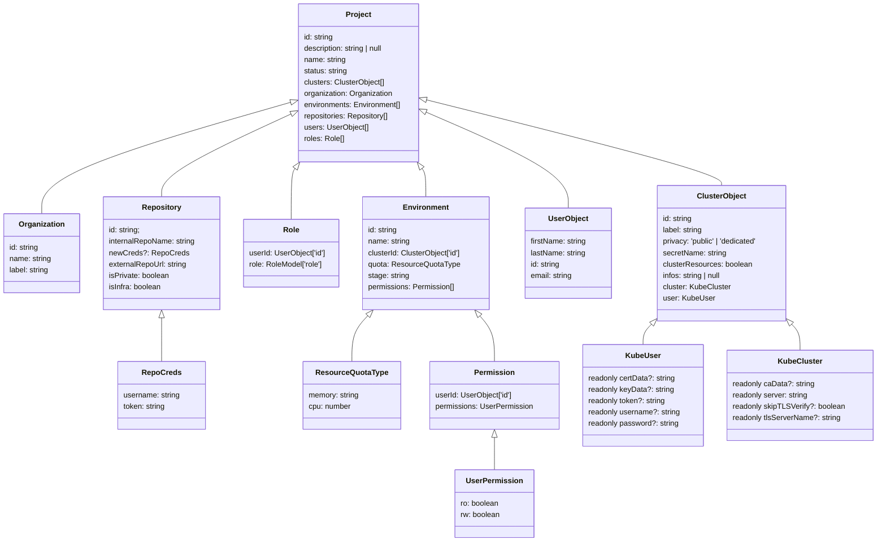

```mermaid
classDiagram
    Project <|-- Organization
    Project <|-- Repository
    Project <|-- Role
    Project <|-- Environment
    Project <|-- UserObject
    Project <|-- ClusterObject

    Repository <|-- RepoCreds

    Environment <|-- ResourceQuotaType
    Environment <|-- Permission
    Permission <|-- UserPermission

    ClusterObject <|-- KubeUser
    ClusterObject <|-- KubeCluster

    class Project{
        id: string
        description: string | null
        name: string
        status: string
        clusters: ClusterObject[]
        organization: Organization
        environments: Environment[]
        repositories: Repository[]
        users: UserObject[]
        roles: Role[]
    }
    class Organization {
        id: string
        name: string
        label: string
    }
    class Repository {
        id: string;
        internalRepoName: string
        newCreds?: RepoCreds
        externalRepoUrl: string
        isPrivate: boolean
        isInfra: boolean
    }
    class ResourceQuotaType {
        memory: string
        cpu: number
    }
    class RepoCreds {
        username: string
        token: string
    }
    class Role {
        userId: UserObject['id']
        role: RoleModel['role']
    }
    class Environment {
        id: string
        name: string
        clusterId: ClusterObject['id']
        quota: ResourceQuotaType
        stage: string
        permissions: Permission[]
    }
    class Permission {
        userId: UserObject['id']
        permissions: UserPermission
    }
    class UserPermission {
        ro: boolean
        rw: boolean
    }
    class UserObject {
        firstName: string
        lastName: string
        id: string
        email: string
    }

    class KubeUser {
        readonly certData?: string
        readonly keyData?: string
        readonly token?: string
        readonly username?: string
        readonly password?: string
    }
    class KubeCluster {
        readonly caData?: string
        readonly server: string
        readonly skipTLSVerify?: boolean
        readonly tlsServerName?: string
    }
    class ClusterObject {
        id: string
        label: string
        privacy: 'public' | 'dedicated'
        secretName: string
        clusterResources: boolean
        infos: string | null
        cluster: KubeCluster
        user: KubeUser
    }

    
```

